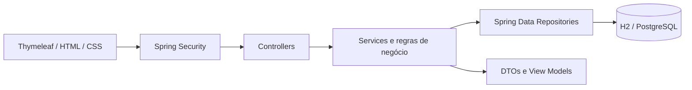

# Controle de Frotas 🚙

[](https://github.com/Lucas-Bonatto/fleetmanager/actions/workflows/ci.yml)

Sistema web Fullstack desenvolvido para centralizar a gestão operacional e financeira de frotas automotivas.

O projeto substitui planilhas dispersas por uma aplicação estruturada, permitindo o cadastro de veículos e motoristas, controle de tributos, acompanhamento de manutenções preventivas e visualização de alertas em um dashboard responsivo.

## 🌐 Aplicação publicada

A aplicação está hospedada no Railway e utiliza conexão segura por HTTPS:

### [Acessar o Controle de Frotas](https://controle-de-frotas.up.railway.app)

> O ambiente público possui acesso protegido por autenticação.  
> As credenciais administrativas não são divulgadas no repositório.

## 📋 Funcionalidades

- Dashboard com indicadores gerais da frota.
- Cadastro, edição, consulta e exclusão de veículos.
- Cadastro e gerenciamento de motoristas.
- Associação entre veículos e motoristas.
- Controle de IPVA, licenciamento, seguros, multas e outros tributos.
- Registro e acompanhamento de manutenções preventivas.
- Controle de manutenções por data e quilometragem.
- Alertas automáticos de tributos e manutenções.
- Validação para impedir a redução acidental do hodômetro.
- Login administrativo com Spring Security.
- Logout seguro com encerramento da sessão.
- Interface responsiva para computadores e dispositivos móveis.
- Banco PostgreSQL no ambiente público.
- Banco H2 para desenvolvimento local.
- Tratamento global de exceções.
- Testes automatizados das regras de negócio.

## 🚦 Status dos tributos

O sistema calcula automaticamente o status de cada tributo:

- **Pago:** pagamento registrado.
- **Atrasado:** vencimento ultrapassado e pagamento pendente.
- **Vencimento próximo:** faltam até 15 dias para o vencimento.
- **No prazo:** tributo pendente fora da janela de alerta.

## 🔧 Status das manutenções

As manutenções são avaliadas por data e quilometragem:

- **Vencida:** prazo ou quilometragem limite ultrapassados.
- **Próxima:** faltam até 30 dias ou até 1.000 km.
- **Em dia:** nenhuma condição de alerta foi atingida.

## 🛠️ Tecnologias utilizadas

### Backend

- Java 21
- Spring Boot
- Spring MVC
- Spring Security
- Spring Data JPA
- Hibernate
- Flyway
- Bean Validation
- Maven

### Frontend

- HTML5
- CSS3
- Thymeleaf
- Layout responsivo

### Banco de dados

- PostgreSQL no ambiente de produção
- H2 no ambiente local

### Infraestrutura

- Git e GitHub
- Railway
- GitHub Actions
- Docker
- Docker Compose

## 🏗️ Arquitetura

O projeto utiliza o padrão arquitetural MVC, com separação de responsabilidades entre controllers, services, repositories, entidades e DTOs.



Estrutura principal:

```text
src/main/java/br/com/fleetmanager
├── config          # configurações, segurança e dados de desenvolvimento
├── domain          # entidades e enums
├── exception       # exceções de domínio
├── repository      # persistência com Spring Data JPA
├── service         # regras de negócio
└── web             # controllers, DTOs e view models
```

## 🔐 Segurança

Todas as páginas do sistema, exceto a tela de login e os arquivos estáticos, exigem autenticação.

O sistema utiliza:

- Spring Security;
- senhas processadas com BCrypt;
- proteção CSRF;
- sessão autenticada;
- logout por requisição POST;
- credenciais de produção armazenadas em variáveis de ambiente;
- conexão HTTPS no ambiente público.

Nenhuma senha do ambiente público é armazenada no código-fonte ou no GitHub.

## 💻 Executando localmente

### Pré-requisitos

- JDK 21
- Maven 3.9 ou superior
- Git

Clone o repositório:

```bash
git clone https://github.com/Lucas-Bonatto/fleetmanager.git
cd fleetmanager
```

Execute os testes:

```bash
mvn clean test
```

Inicie a aplicação:

```bash
mvn spring-boot:run
```

Acesse:

```text
http://localhost:8080
```

A aplicação redirecionará automaticamente para:

```text
http://localhost:8080/login
```

As credenciais locais podem ser alteradas por meio das variáveis:

```bash
ADMIN_USERNAME=seu_usuario
ADMIN_PASSWORD=sua_senha
```

## 🗄️ PostgreSQL

No ambiente de produção, a aplicação utiliza as seguintes variáveis:

```bash
SPRING_PROFILES_ACTIVE=prod
PGHOST=servidor
PGPORT=5432
PGDATABASE=banco
PGUSER=usuario
PGPASSWORD=senha
ADMIN_USERNAME=usuario_administrativo
ADMIN_PASSWORD=senha_administrativa
```

No Railway, as cinco variáveis `PG*` devem ser referências ao serviço PostgreSQL, por exemplo `PGHOST=${{Postgres.PGHOST}}`. As informações reais são configuradas diretamente na plataforma e não são versionadas.

### Migrações de banco

O Flyway aplica as migrações de `src/main/resources/db/migration` antes de o Hibernate validar o schema. A aplicação usa `ddl-auto: validate`: produção nunca altera tabelas de forma implícita e um schema incompatível interrompe o deploy.

Em um banco novo, mantenha `FLYWAY_BASELINE_ON_MIGRATE=false` (valor padrão) para executar a migração V1 normalmente.

Para adotar o Flyway em um banco **já existente**, faça backup e defina `FLYWAY_BASELINE_ON_MIGRATE=true` somente no primeiro deploy. Isso registra o schema atual como versão 1 sem recriar tabelas; após o deploy validado, remova a variável. Não mantenha essa opção ativa permanentemente.

## 🐳 PostgreSQL com Docker

Para executar um PostgreSQL local:

```bash
docker compose up -d
```

Depois, inicie o sistema com o perfil de produção:

```bash
mvn -Dspring-boot.run.profiles=prod spring-boot:run
```

Também é possível gerar a imagem da aplicação:

```bash
docker build -t fleetmanager .
```

## 🧪 Testes

Execute:

```bash
mvn clean test
```

O projeto possui testes para as principais regras de status de tributos e manutenções e para a criação completa do schema pelo Flyway.

O GitHub Actions executa a suíte em H2 e repete a migração contra PostgreSQL 17 a cada alteração enviada ao repositório.

## 🚀 Deploy

O deploy da aplicação é realizado automaticamente pelo Railway a partir da branch `main` do GitHub.

Fluxo de publicação:

```text
Código local
    ↓
GitHub
    ↓
Railway
    ↓
Spring Boot
    ↓
PostgreSQL
```

Cada novo `push` para a branch principal inicia uma nova compilação e publicação.

O endpoint público `/actuator/health` é reservado ao healthcheck da plataforma e não expõe detalhes internos. No Railway, configure esse caminho como verificação de saúde antes de promover uma nova versão.

## 📌 Possíveis evoluções

- Cadastro de diferentes usuários.
- Perfis de administrador, gestor e motorista.
- Recuperação de senha.
- Upload de documentos e comprovantes.
- Controle de abastecimentos.
- Cálculo de consumo médio.
- Relatórios financeiros por veículo.
- Exportação de relatórios em PDF.
- Notificações por e-mail ou WhatsApp.
- Testes de integração com Testcontainers.

## 👨‍💻 Autor

Desenvolvido por **Lucas Bonatto**.

Projeto criado para estudo e portfólio, aplicando conceitos de desenvolvimento Fullstack, orientação a objetos, arquitetura MVC, persistência de dados, segurança e publicação em nuvem.

## 📄 Licença

Distribuído sob a licença MIT.
