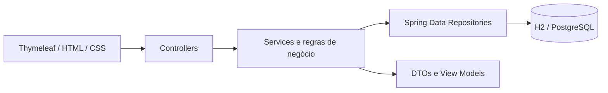

# FleetManager 🚙

Aplicação web Fullstack para centralizar a gestão operacional e financeira de frotas automotivas. O sistema substitui planilhas dispersas por cadastros estruturados, alertas de tributos e previsões de manutenção baseadas em data e quilometragem.

## Funcionalidades do MVP

- Dashboard com indicadores da frota e alertas prioritários.
- CRUD de veículos e motoristas.
- Controle de IPVA, licenciamento, seguros, multas e outros tributos.
- Status financeiro calculado e priorizado no backend: **Pago**, **Atrasado**, **Vencimento próximo** e **No prazo**.
- Histórico e previsão de manutenções por calendário e quilometragem, com validação cronológica.
- Alertas de manutenção: **Vencida**, **Próxima** e **Em dia**.
- Interface responsiva renderizada com Thymeleaf.
- Dados demonstrativos automáticos no perfil de desenvolvimento.
- Banco H2 para execução local e perfil pronto para PostgreSQL.
- Testes unitários das regras centrais e pipeline de CI com GitHub Actions.

## Tecnologias

- Java 21
- Spring Boot 4.1.0
- Spring MVC
- Spring Data JPA / Hibernate
- Thymeleaf
- Bean Validation
- H2 e PostgreSQL
- Maven
- JUnit 5 / AssertJ

## Arquitetura



```text
src/main/java/br/com/fleetmanager
├── config          # carga de dados de demonstração
├── domain          # entidades e enums
├── exception       # exceções de domínio
├── repository      # persistência Spring Data JPA
├── service         # regras de negócio e status
└── web             # controllers, DTOs e view models
```

## Regras de alerta

### Tributos

- **Pago:** pagamento marcado como realizado.
- **Atrasado:** não pago e vencimento anterior à data atual.
- **Vencimento próximo:** não pago e faltam até 15 dias.
- **No prazo:** não pago e fora da janela de alerta.

### Manutenções

- **Vencida:** data ultrapassada ou quilometragem limite atingida.
- **Próxima:** faltam até 30 dias ou até 1.000 km.
- **Em dia:** nenhuma janela de alerta foi atingida.

## Executando localmente

### Pré-requisitos

- JDK 21
- Maven 3.6.3 ou superior

```bash
git clone https://github.com/SEU-USUARIO/fleetmanager.git
cd fleetmanager
mvn spring-boot:run
```

Acesse:

- Aplicação: `http://localhost:8080`
- Console H2: `http://localhost:8080/h2-console`
- JDBC URL: `jdbc:h2:file:./data/fleetmanager`
- Usuário: `sa`
- Senha: vazia

## PostgreSQL com Docker

```bash
docker compose up -d
mvn -Dspring-boot.run.profiles=prod spring-boot:run
```

No perfil `prod`, as variáveis abaixo podem substituir os valores padrão:

```bash
DATABASE_URL=jdbc:postgresql://localhost:5432/fleetmanager
DATABASE_USERNAME=fleetmanager
DATABASE_PASSWORD=fleetmanager
```

> O perfil de produção usa `ddl-auto: update` para facilitar a demonstração. Em uma implantação real, utilize migrações versionadas com Flyway ou Liquibase.

## Publicando no GitHub

Crie um repositório vazio chamado `fleetmanager` e execute:

```bash
git init
git add .
git commit -m "feat: cria MVP do FleetManager"
git branch -M main
git remote add origin https://github.com/SEU-USUARIO/fleetmanager.git
git push -u origin main
```

## Testes

```bash
mvn clean test
```

## Próximas evoluções

- Autenticação e autorização com Spring Security.
- Perfis de administrador, gestor e motorista.
- API REST documentada com OpenAPI.
- Upload de documentos e comprovantes.
- Notificações por e-mail ou WhatsApp.
- Abastecimentos e cálculo de consumo médio.
- Relatórios financeiros por veículo e período.
- Migrações versionadas de banco com Flyway.
- Testes de integração com Testcontainers.

## Licença

Distribuído sob a licença MIT.
